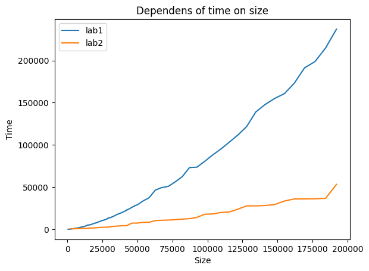

# Лабораторая работа №2

## Задание: 
1. Модифицировать программу из л/р №1 для параллельной работы по технологии OpenMP.

## Характеристики ЭВМ
1. CPU - AMD Ryzen 5 3600
2. GPU - Nvidia GeForce GTX 1660s (6gb)
3. RAM 16 GB 3200 MHz

## Результаты: 
[Code source](https://github.com/c0de1sl1fe/multithreading/tree/main/lab1)
1. исходные файлы с матрицами: "matrix1.txt", "matrix2.txt" 
2. результат перемножения: "res_cpp.txt"
3. файлы статистики: "stats_lab1.txt", "stats_lab2.txt"

### Source.cpp
Данный файл содержит в себе основной блок кода, в котором выполняется считывание матриц из файлов, перемножение и запись полученной матрицы, также выполняется запись количества элементов и времени выполнения<br>
Реализация параллельного вычисления матриц:
```
int** mulMatrix_omp(int** a, int** b, int row1, int col1, int row2, int col2)
{
    if (col1 != row2)
    {
        return NULL;
    }

    int row = row1, col = col2;
    int** res = createMatrix(row, col);
    int threads_num = omp_get_max_threads();
    #pragma omp parallel num_threads(threads_num)
    {
        #pragma omp for 
        for (int i = 0; i < row; i++)
        {
            for (int j = 0; j < col; j++)
            {
                for (int k = 0; k < row2; k++)
                {
                    res[i][j] += a[i][k] * b[k][j];
                }
            }
        }
    }
    return res;
}
```

### Main.py
В данном файле содержатся функции генерации матриц, проверки переможения и создания графика полученного по результатам эксперимента

1. `def genMatrix(a: int, b: int, c: int, path1: str, path2: str):`
2. `def write_matrix(path: str, mt: np.array):`
3. `def read_matrix(path: str) -> np.array:`

### График 
В результате проведения лабораторной работы была построена следующая зависимость времени выполнения от количества элементов<br>

[res_lab1](stats_lab1.txt)
[res_lab2](stats_lab2.txt)
## Выводы
Опираясь на полученные результаты можно сделать вывод, стандарт _OpenMP_ позволяет ускорить исследуемую операцию. Каждый поток работает над своей частью результирующей матрицы, что позволяет эффективнее использовать вычислительные ресурсы и уменьшить время выполнения операции умножения.
